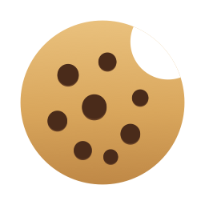

# Nibble

A macOS menu-bar app that shows how much of your Claude subscription quota is left, so
you don't have to keep checking `/usage` while you work.

```
🍪 5h 88% · wk 75% · F 81%
```

*(A nibble is four bits. Also what you're doing to your quota.)*

The three numbers are your 5-hour session window, your weekly all-models window, and
your weekly model-scoped window. The text turns orange past 75% and red past 90%, so a
glance tells you whether to worry. Click it for reset countdowns, a 7-day token chart
broken down by model, and what the week would have cost at pay-as-you-go API prices.

**Status:** first release. It works, and it's built on an endpoint Anthropic doesn't
document — see [Caveats](#caveats) before depending on it.

## Requirements

- macOS 14 or later
- A Claude subscription (Pro or Max)
- [Claude Code](https://claude.com/claude-code) installed and signed in — it supplies
  both the login Nibble reads and the logs behind the 7-day chart

## Install

```sh
git clone https://github.com/jeff613/nibble.git
cd nibble
make install
```

That builds `Nibble.app`, copies it to `/Applications`, and launches it. The menu-bar
item reads `🍪 Connect` until you finish setup.

Because the app is signed with a local ad-hoc signature rather than a paid Apple
Developer certificate, macOS may refuse to open it the first time. If it does, go to
**System Settings → Privacy & Security**, scroll down, and click **Open Anyway**. You
only have to do this once.

## Connecting your account

Click the menu-bar item, then click **Use my Claude Code login** — the gauges fill in.

### What this means, precisely

Nibble reads the OAuth token that Claude Code has already stored on this machine — in
your Keychain, or `~/.claude/.credentials.json`. That is the same credential Claude Code
uses to render its own `/usage` output. The Keychain read goes through Apple's
`security` tool, the same way Claude Code itself reads and writes the item, so there is
no separate macOS approval prompt.

- **Nothing is read until you click that button.** That click is the consent gate, and
  **Disconnect** withdraws it.
- **The token is never copied.** It's read fresh on each check, so it stays valid as
  Claude Code rotates it. The only thing Nibble persists is a boolean recording that
  you connected.
- **It goes nowhere but Anthropic.** The token is used for one request to
  `api.anthropic.com` and is never logged, transmitted elsewhere, or written to disk.

**Disconnect** in the panel's `⋯` menu makes the app forget your consent and stop
reading anything. To revoke the underlying login, run `claude auth logout`.

### Why not a token you paste in yourself?

That was the original design, and it would be cleaner — but it doesn't work. Tokens from
`claude setup-token` are *inference*-scoped: they let scripts spend your subscription on
API calls. The usage endpoint is *account*-scoped, and returns HTTP 403 for them. There's
no flag to widen the scope.

The other option is a browser login flow, which this project deliberately doesn't do.
Anthropic offers no public OAuth client registration for subscriptions, so any
third-party app doing that must reuse Claude Code's client ID — meaning you'd approve a
consent screen naming Claude Code for software Anthropic didn't write. Reading a
credential you already chose to store, behind an explicit in-app consent step, is the
more honest of the two.

## What it reads

| Data | Source |
|---|---|
| Live quota percentages and reset times | Claude: `GET https://api.anthropic.com/api/oauth/usage`. Optional Codex and Grok logins from the panel `⋯` menu use the same usage endpoints those CLIs already poll. |
| 7-day token history and cost estimate | Local logs: `~/.claude/projects/**/*.jsonl`, `~/.codex/sessions/**/rollout-*.jsonl`, `~/.grok/sessions/**/updates.jsonl`. Read-only, never uploaded. |

If you have Claude Code signed in but rarely use it, the quota gauges still work; the
history chart will just be empty.

### Refresh rate

The usage endpoint enforces an hourly budget and answers a breach with a `Retry-After`
measured in tens of minutes, so Nibble spends a request only when one can actually
reveal a change, rather than polling on a timer and hoping.

Your quota moves for exactly two reasons, and both are predictable:

- **You used Claude.** A file watcher on `~/.claude/projects` notices, and the log scan
  distinguishes real token usage from an unrelated write — a request is spent only when
  new usage actually landed.
- **A window reset.** Every window reports its `resets_at`, so the app wakes just after
  one passes to catch the jump back to 0%.

Everything else is a backstop for usage that never touches this Mac (claude.ai in a
browser, or a second machine): every 2 minutes while Claude Code is active, every 15
minutes when idle. A hard 60-second floor applies between calls no matter what triggers
them, capping the worst case at 60 requests an hour.

If the endpoint does rate limit you, the panel shows a live countdown and the app sleeps
until the penalty expires — including across restarts, so quitting and reopening won't
re-trip it.

### Model colours

Each short model name has a fixed colour so the chart reads the same every launch
(`opus-5`, `gpt-5.6-sol`, `grok-4.6`, …). They're pinned in `ModelPalette` rather
than left to Swift Charts, which assigns colours by category position.

## Caveats

**The usage endpoints are not public, documented APIs.** Claude's is the internal
endpoint Claude Code uses to render `/usage`. Codex uses ChatGPT's `wham/usage`
route; Grok uses Grok Build billing. Vendors can change or remove them without
notice. Treat Nibble as a convenience, not something to depend on.

The menu bar shows one provider at a time (Claude by default). Pick another from
**Menu bar** at the bottom of the panel after connecting Codex or Grok.

The cost figure is an *estimate* of what your logged usage would have cost at published
API list prices. It is not a bill, it does not reflect what you actually pay for your
subscription, and models with no entry in the pricing table are counted in the token
chart but excluded from the cost line.

## Contributing

`main` holds released, working code. `develop` is where work lands. Branch from
`develop`, and open pull requests against it.

```sh
git checkout develop
git checkout -b my-change
make test
```

Please keep logic in `NibbleCore` where it can be unit tested, and keep `Nibble` a thin
shell over it. If you're changing behaviour, a test that fails before your fix is worth
more than one that passes after it.

## Development

```sh
make test    # run the unit tests
make run     # run from source without bundling
make app     # build Nibble.app without installing it
make icon    # redraw the cookie from Tools/GenerateIcon.swift
```

The code is split in two: `NibbleCore` holds all the logic (API decoding, log
scanning, aggregation, pricing, formatting, refresh policy) and has no UI dependencies,
so it is covered by unit tests. `Nibble` is a thin AppKit + SwiftUI shell over it.

If `make test` can't find XCTest, your `xcode-select` is pointing at CommandLineTools;
the Makefile already redirects to `/Applications/Xcode.app` when it exists.

The icon isn't a checked-in image someone has to trust — it's drawn by
`Tools/GenerateIcon.swift` with CoreGraphics, so you can read exactly how the cookie is
made and change it. `make icon` regenerates both the app icon and the monochrome
menu-bar glyph.

## License

MIT
